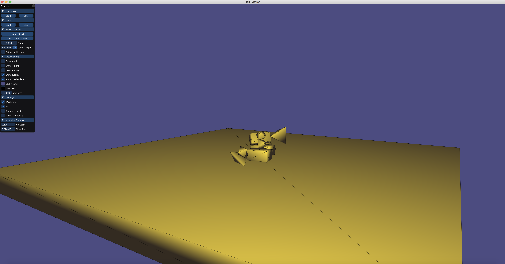

# Practical 1: Rigid-Body Simulation

##Handout date: 19/Feb/2019.

##Deadline: 5/Mar/2019 09:00AM.

The first practical is about simulating the motion of rigid bodies, and their interactions through collision resolution. The objectives of the practical are:

1. Implement rigid velocity, position, and orientation integration in a discrete-time iteration.
 <br />
2. Implement interpenetration resolution.
 <br />
2. Implement impulse-based collision resolution.
 <br />
3. Extend the framework with some chosen effects.  

This is the repository for the skeleton on which you will build your first exercise. Using CMake allows you to work and submit your code in all platforms. The entire environment is in C++, but most of the "nastier" coding parts have been simplified; for the most part, you only code the mathemtical-physical parts.


##Scope

The basic scenario is limited in scope to convex objects, and includes no air resistance or friction. The environment loads scenes that describe a set of objects, and their positions in space. The world contains a big, immobile (fixed) plate on which the objects fall. There are no ambient forces in the basic setting other than earth's gravity, pulling towards the negative $y$ axis.

The environment is already configured to run in a time loop, where it detects collisions in each step. Collisions are assumed to be with a single point of contact per object per time-frame, and in case of more, one point is chosen (this might lead to mildly non-physical behavior).

The practical includes the following basic mandatory requirements:


1. For every time step, integrate the accelerations (linear and angular) into velocities, and the velocities into positions and orientations. Use an *Euler forward scheme*, as learned in class (Lecture 5). This requires changing both the position of the COM by the linear velocity, and the orientation by the angular velocity (Lecture 3). the time step difference $\Delta t$ is given by the GUI, and controllable by the menu.
<br />
2. For every time step, resolve interpenetration (Lecture 4) *linearly*. The means, given the penetration point, depth, and normal, move the objects apart linearly so they are only tangent. You may assume there is a single point of contact, and not required to solve multiple interpenetrations in the iterative manner.
<br />
3. For every time step, resolve the collision by assigning opposite impulses to two colliding objects, and correcting their velocities instantaneously (Lecture 4). This will change both the linear and the angular velocities. The environment computes the inverse inertia tensor for you, given in the original orientation of the object (as appears in the file), and around its COM. You are responsible to transform the inverse inertia tensor to what is needed upon the moment of collision.

See below for details on where to do all that in the code.

###Extensions

The above will earn you $70\%$ of the grade. To get a full $100$, you must choose 2 of these 6 extension options, and augment the practical. Some will require minor adaptations to the GUI or the function structure which are easy to do. Each extension will earn you $15\%$, and the exact grading will commensurate with the difficulty. Note that this means that all extensions are equal in grade; if you take on a hard extension, it's your own challenge to complete it well.

1. Add low-velocity drag forces in the air (Lecture 1). You should use the *total velocity* (the entire velocity of a point from linear and angular velocity), and a drag coefficient which is controllable by the user. **Level: easy**.
 <br />
2. Add friction to the collision impulses (Lecture 4), again with a user-controllable coefficient. **Level: easy**.
 <br />
3. Change the time-integration system to one of the more sophisticated methods learned in class. The improvement should be exemplified with a proper scene, if exists. **Level: intermediate**.
 <br />
4. Resolve interpenetration with an additional rotational movement. For that you will have to decide on a good heuristic. I suggest to read chapter 14 in Ian Millington's [Game Physics Engine Development](https://www.crcpress.com/Game-Physics-Engine-Development-How-to-Build-a-Robust-Commercial-Grade/Millington/p/book/9780123819765). **Level: intermediate**.
 <br />
5. Add a possibility in both the interface, and the program, for objects to start with some initial velocity (like throwing stuff around) **Level: easy**.
Possible further extension: allow to "push" an object with an artificial force/impulse. **Extension level: easy-intermediate**.
 <br />
6. Resolve multiple interpenetrations and collisions. It is not easy to demonstrate, and you will have to build a scene file that proves you did the job correctly. This should involve many objects tightly packed. **Level: hard**.

You may invent your own extension as substitute to **one** in the list above, but it needs approval on the Lecturer's behalf **beforehand**.


##Installation

The skeleton uses the following dependencies: [libigl](http://libigl.github.io/libigl/), and consequently [Eigen](http://eigen.tuxfamily.org/index.php?title=Main_Page), for the representation and viewing of geometry, and [libccd](https://github.com/danfis/libccd) for collision detection. libigl viewer is using [dear imGui](https://github.com/ocornut/imgui) for the menu. Everything is bundled as either submodules, or just incorporated code within the environment, and you do not have to take care of any installation details. To get the library, use:

```bash
git clone --recursive https://github.com/avaxman/INFOMGP-Practical1.git
```

to compile the environment, go into the `practical1` folder and enter in a terminal (macOS/Linux):

```bash
mkdir build
cd build
cmake -DCMAKE_BUILD_TYPE=Release ../
make
```

In windows, you need to use [cmake-gui](https://cmake.org/runningcmake/). Pressing twice ``configure`` and then ``generate`` will generate a Visual Studio solution in which you can work. The active soution should be ``practical1_bin``. *Note*: it only seems to work in 64-bit mode. 32-bit mode might give alignment errors.

##Using the dependencies

You do not need to acquaint yourself much with any dependency, nor install anything auxiliary not mentioned above. For the most part, the dependencies are parts of code that are background, or collision detection code, which is not a direct part of the practical. The most significant exception is [Eigen](http://eigen.tuxfamily.org/index.php?title=Main_Page) for the representation and manipulation of vectors and matrices. However, it is a quite a shallow learning curve. It is generally possible to learn most necessary aspects (multiplication of matrices and vectors, intialization, etc.) just by looking at the existing code. However, it is advised to go through the "getting started" section on the Eigen website (reading up to and including "Dense matrix and array manipulation" should be enough).

##Working with the repository

All the code you need to update is in the ``practical1`` folder. Please do not attempt to commit any changes to the repository. <span style="color:red">You may ONLY fork the repository for your convenience and work on it if you can somehow make the forked repository PRIVATE afterwards</span>. Solutions to the practical which are published online in any public manner will **disqualify** the students! submission will be done in the "classical" department style of submission servers, published separately.

##The coding environment for the tasks

Most of the action happens in `scene.h`. The main function is:

```cpp
void updateScene(double timeStep, double CRCoeff){

    //integrating velocity, position and orientation from forces and previous states
    for (int i=0;i<meshes.size();i++)
      meshes[i].integrate(timeStep);

    //detecting and handling collisions when found
    //This is done exhaustively: checking every two objects in the scene.
    double depth;
    RowVector3d contactNormal, penPosition;
    for (int i=0;i<meshes.size();i++)
      for (int j=i+1;j<meshes.size();j++)
        if (meshes[i].isCollide(meshes[j],depth, contactNormal, penPosition))
          handleCollision(meshes[i], meshes[j],depth, contactNormal, penPosition,CRCoeff);

    currTime+=timeStep;
  }
```

The two most important functions are ``integrate()`` and ``handleCollision()``. They all contain a mixture of written code, and code you have to complete. The code you have to complete is always marked as:

```cpp
/***************
TODO
***************/
```

The description of the function will tell you what exactly you need to put in.

###Input

The program is loaded by giving a TXT file that describes the scene as an argument to the executable. The file should be in the `data` subfolder, which is automatically discovered by the CMake. The format of the file is:

```
#num_objects
object1.mesh  density1  youngModulus1 PoissonRatio1 is_fixed1    COM1     q1
object2.mesh  density2  youngModulus2 PoissonRatio2 is_fixed2    COM2     q2
.....
```

Where:

1. ``objectX.mesh`` - an MESH file (automatically assumed in the `data` subfolder) describing the geometry of a tetrahedral mesh. The original coordinates are translated automatically to have $(0,0,0)$ as their COM.
<br />
2. ``density`` - the uniform density of the object. The program will automatically compute the total mass by the volume.
<br />
3. ``is_fixed`` - if the object should be immobile (fixed in space) or not.
<br />
4. ``COM`` - the initial position in the world where the object would be translated to. That means, where the COM is at time $t=0$.
<br />
5. ``q`` - the initial orientation of the object, expressed as a quaternion that rotates the geometry to $q*object*q^{-1}$ at time $t=0$.
<br />
6. ``youngModulus1`` and  ``PoissonRatio1`` should be ignored for now; we will use them in the $3^{rd}$ practical.

###User interface



The viewer presents the loaded scene, and you may interact with the viewing with the mouse: rotate with the left button pressed and moving around (the "[" and "]" buttons change the behaviour of the trackball), zoom with the mousewheel, and translate with the right button pressed and dragging. Some other options are printed to the output when the program starts.

The menu also controls the visual features, and the setting of the coefficient of restitution and the time step. They can be updated at any point in the simulation. You might add more parameters with some extensions. Everything is set up in `main()`.

The simluation can be run in two modes: continuously, toggled with the `space` key (to stop/run), and step by step, with the `S` key. This behavior is already encoded. The visual update of the scene from the objects is also already encoded.

###Data structure

There are two main classes, `scene`, and `Mesh`. Both are in `scene.h`, and will be updated by you. They are commented throughout, so their individual properties are understood. Each mesh, and the platform, are rigid bodies of their own. The geometry is encoded as follows:

```cpp
MatrixXd origV;   //original vertex positions, where COM=(0.0,0.0,0.0) - never change this!
MatrixXd currV;   //current vertex position
```

`origV` and `currV` are $\left| V \right| \times 3% times 3$ matrices encoding all the vertices of the mesh, row by row. You should **never update `origV`**. `currV` should be updated to reflect the result of every time step, and this is what you see on screen.

Quaternions represent orientations and rotations, where if the neutral (initial) orientation of a vector is $v$, and the orientation quaternion is $q$, then the final orienation is $qvq^{-1}$. The `QRot` function in the `auxfunctions.h` file implements that (and several other functions for quaternions are available in that file). Note the function `Q2RotMatrix` that produces the rotation matrix corresponding to that orientation, which should be used for the transformation of the inertia tensor.

###Existing software components

You do not have to compute the entire algorithmic environment from scratch. The things that you are given are:

1. Collision detection, as explained above.
<br />
2. A function `initStaticProperties` computes the original COM and the inverse inertia tensor for each original MESH files, and is called by the `Mesh` constructor. you do not need the COM it computes; the constructor translates the object (`origV` coordinates) to the origin, so it always has $COM=\left(0,0,0\right)$. The constructor also initializes `currV` as a translation and rotation of `origV` to fit the prescribed values from the scene file.

The inverse inertia tensor you get from `initStaticProperties` is **not after applying the orientation, not even that in the scene file**. That is, what you get is the inverse inertia tensor of ``origV`` around its COM. You will have to compute the inverse inertia tensor for a given `currV`, according to the its current orientation, and it is always then around the COM of the moving object. See Lecture 3 for how to do that efficiently, and be careful to apply the correct rotation!

##Submission

The entire code of the practical has to be submitted in a zip file to the lecturer by E-mail. The deadline is **5/Mar/2019 09:00AM**. Students who have not submitted the practical by that time **will not be checked** in the session.

The practical must be done **in pairs**. Doing it alone requires a-priori permission. Any other combination (more than 2 people, or any number not in $\mathbb{N}$) is not allowed.

The practical will be checked during the slot for the lecture time at the deadline date (instead of a lecture that day). Every pair will have 10 minutes to shortly present their practical, and be tested by the lecturer with some fresh scene files. In addition, the lecturer will ask every person a short question that should be easy to answer if this person was fully involved in the practical. 

The students often come with their own computers, and in this case you must come with an operating executable, compiled already in *release* mode, and working on all given scene files. **Note:** this semester the course is large, and therefore the checking times will be strict. If you cannot come with your own computer, tell me in advance, and I will compile them on mine beforehand.

The registration for time slots is in our [public sheet](https://docs.google.com/spreadsheets/d/1Zeo2mPu_wv9xjMrAFdzhcTyMGLOpsJqtaf_4Y4oSp2I/edit#gid=1738095803) in the ``Time Slots - Practical 1`` tab. You are not obligated to write your own explicit names---if you do not wish to do so, just write "occupied" and tell me by E-mail who you are and in which slot. Please do not change other people's time choices without their consent.

##Frequently Asked Questions

Here are detailed answers to common questions. Please read through whenever ou have a problem, since in most cases someone else would have had it as well.

<span style="color:blue">Q:</span> I am getting "alignment" errors when compiling in Windows.
<span style="color:blue">A:</span> Delete everything, and re-install using 64-bit configuration in `cmake-gui` from a fresh copy. If you find it doesn't work from the box, contact the Lecturer. Do not install other non-related things, or try to alter the cmake.


<span style="color:blue">Q:</span> Why is the demo not working out of the box?
<span style="color:blue">A:</span>: with the same parameters as your input program: infomgp_practical1 "folder_name_without_slash" "name of txt scene files".

<span style="color:blue">Q:</span> How do I do inverse mass weighting for linear interpenetration?
<span style="color:blue">A:</span>: Given two objects with masses $m_1,m_2$ interpenetrating in mutual distance $d$, their individual corrections need to be $d_1=\frac{d \cdot m_1}{m_1+m_2}$ and respectively for $d_2$. Note that: 1) the lighter object needs to move more (that's why it's inverse) 2) if one object is fixed, it's like it has infinite mass, and the other object moves all the way back.


The practical will be checked during a special session in the deadline date . Every pair will have 10 minutes to shortly present their practical, and be tested by the lecturer with some fresh scene files. In addition, the lecturer will ask every person a short question that should be easy to answer if this person was fully involved in the exercise. This will typically be a double session in our regular slot B; check the calendar. 

##Frequently Asked Questions

Here are detailed answers to common questions. Please read through whenever you have a problem, since in most cases someone else would have had it as well.

<span style="color:blue">Q:</span> I am getting "alignment" errors when compiling in Windows.
<span style="color:blue">A:</span> Delete everything, and re-install using 64-bit configuration in `cmake-gui` from a fresh copy. If you find it doesn't work from the box, contact the Lecturer. Do not install other non-related things, or try to alter the cmake. 

<span style="color:blue">Q:</span> I have an angular velocity $\overline{\omega}$, how do I integrate it?
<span style="color:blue">A:</span> <span style="color:red">Changed answer</span>: this is fully explained in class (Lecture 5).


#Good work!
